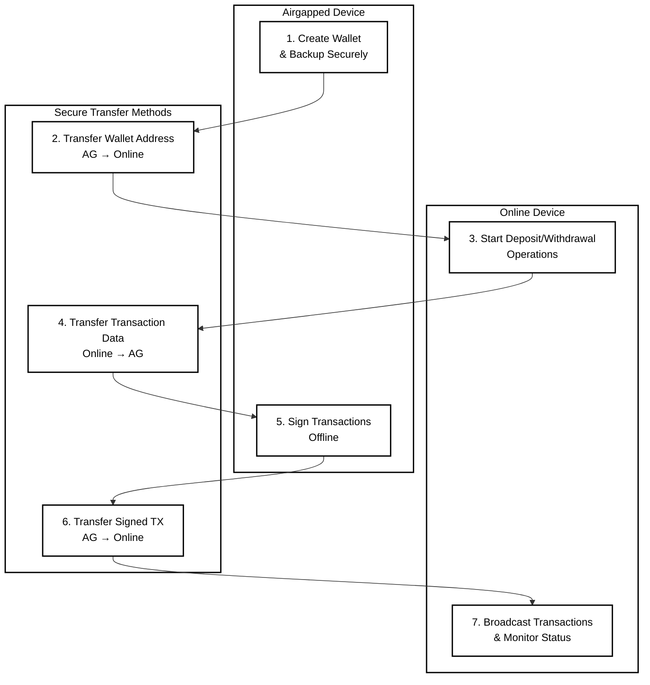

# Clementine CLI Documentation

Welcome to the complete user guide for Clementine CLI.

## Documentation Structure

This documentation is organized into specialized guides for each major operation:

### User Guides

- **[Wallet Operations](wallet.md)** - Create, import, backup, and manage Clementine wallets
- **[Deposit Guide](deposit.md)** - Move Bitcoin to Citrea network
- **[Withdrawal Guide](withdraw.md)** - Move funds back to Bitcoin

## Getting Started

### Two-Device Security Model

Clementine CLI is designed for maximum security using separate airgapped and online devices:

**Airgapped Device (Offline):**

- Install Rust and Clementine CLI via USB or secure offline method
- Perform ALL wallet creation and key operations
- Generate ALL signatures and cryptographic operations
- NEVER connect to internet or networks

**Online Device (Internet-Connected):**

- Monitor deposit/withdrawal status
- Generate addresses for verification
- Broadcast transactions to Bitcoin network
- Access to a Esplora Rest API or a Bitcoin Core RPC API

### Essential Two-Device Workflow



**Secure Workflow Steps:**

1. **[Airgapped]** [Create wallet](wallet.md#create-wallet) and backup securely
2. **[Transfer]** Move the wallet address to online device
3. **[Online]** Start deposit/withdrawal operations using the wallet address
4. **[Transfer]** Move transaction data to airgapped device for signing
5. **[Airgapped]** Sign transactions securely offline
6. **[Transfer]** Move signed transactions back to online device
7. **[Online]** Broadcast transactions to network and monitor status

## Command Structure

See:

```sh
clementine-cli --help
```

### Global Options

| Option | Description | Required |
|--------|-------------|----------|
| `--config-file` | Custom config file path | No |
| `--verbose` | Enable detailed logging | No |

### Main Commands

| Command | Purpose | Guide |
|---------|---------|-------|
| `wallet` | Wallet management | [→ Wallet Guide](wallet.md) |
| `deposit` | Bitcoin to Citrea | [→ Deposit Guide](deposit.md) |
| `withdrawal` | Citrea to Bitcoin | [→ Withdrawal Guide](withdraw.md) |

## Security Framework

### **Critical Security Requirements**

- **Airgapped Operations**: Key generation and signing MUST be performed offline
- **Backup Everything**: Wallet files, recovery phrases, and transaction IDs
- **Verify Always**: Double-check addresses and amounts before signing
- **Recovery Planning**: Save all recovery information to use if needed

### **Operational Security**

1. **Device Isolation**: Airgapped device never touches networks
2. **Data Verification**: Always cross-verify addresses and amounts between devices
3. **Backup Strategy**: Multiple encrypted backups in geographically separated locations
4. **Transfer Security**: Use formatted USB drives or QR codes, never cloud storage
5. **Documentation**: Maintain detailed logs of all operations and transaction IDs

## Support & Troubleshooting

### Getting Help

- **Command Help**: `clementine-cli --help` or `clementine-cli <command> --help`
- **Verbose Logging**: Add `--verbose` flag for detailed operation logs
- **Configuration**: Check config file location and network settings
